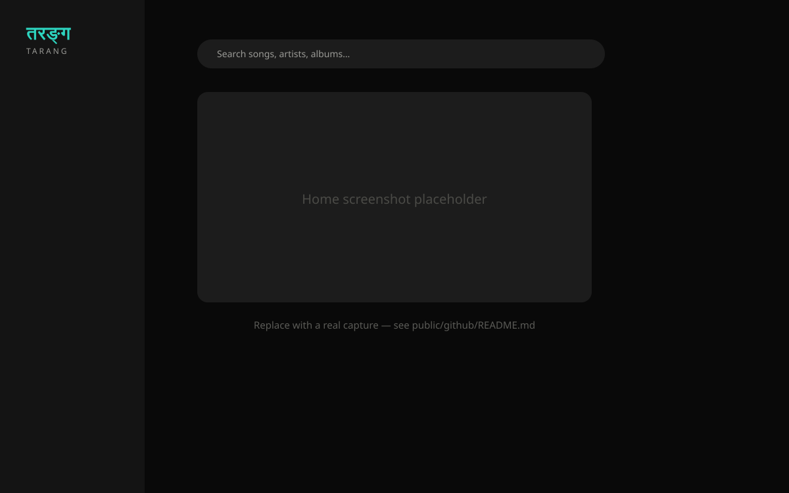
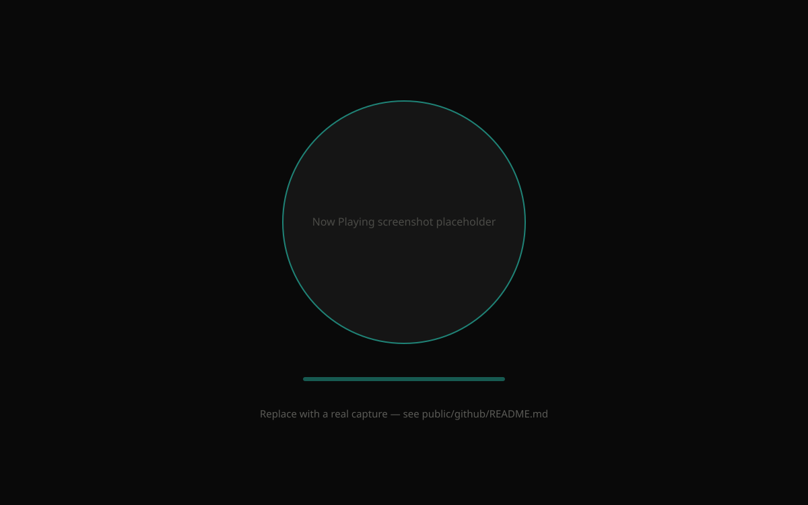
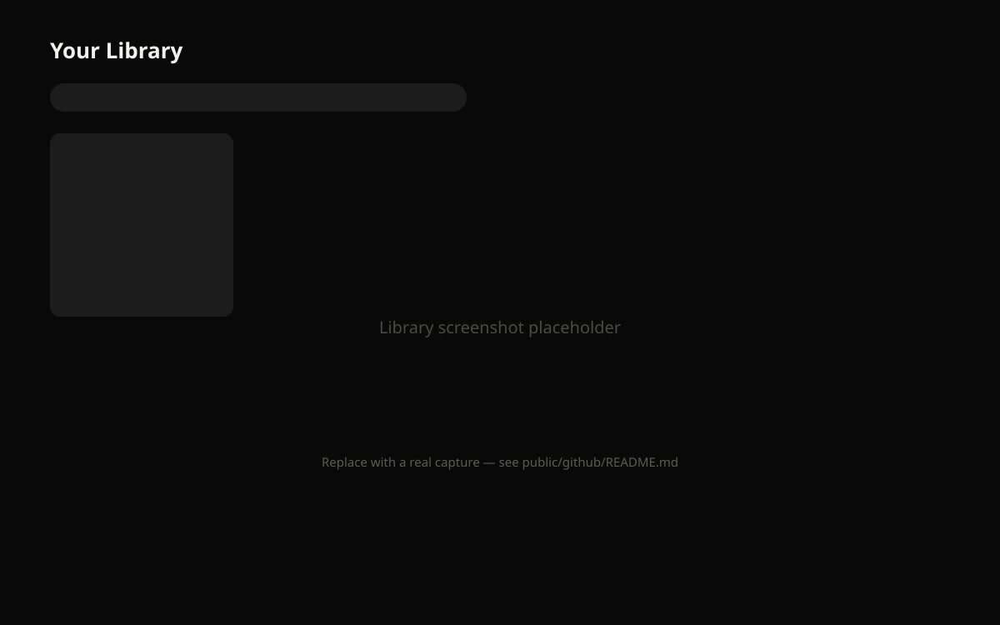

<div align="center">

# तरङ्ग · Tarang

**A music-first streaming interface. Just the music.**

[](./CHANGELOG.md)
[](./docs/v3-release-report.md)
[](https://nextjs.org)
[](https://react.dev)
[](https://www.typescriptlang.org)
[](https://tailwindcss.com)
[](./LICENSE)

[Live demo](#) · [Documentation](./docs) · [Changelog](./CHANGELOG.md) · [Contributing](./CONTRIBUTING.md)

</div>

---

## Overview

Tarang (तरङ्ग, Sanskrit for *wave*) is a dark-only, music-first streaming UI built as a from-scratch design-system exercise: every color, spacing value, radius, shadow, typographic size, and motion curve traces back to a single token file — nothing is picked ad hoc. It ships a full Home / Search / Library / Artist / Album / Playlist / Moods / Downloads / Stats / Settings surface, a real audio player with a shared-element mini-player ↔ full-player transition, a drag-reorderable queue, and an accessibility-first component library.

This is a **frontend-only release candidate** — there is no backend, no database, and no authentication. All catalog data is static seed data, and artwork is placeholder imagery from `picsum.photos`. See [Known Issues](#known-issues) below.

<p align="center">
  
</p>

## Highlights

- 🎨 **Complete design system** — semantic color/radius/elevation tokens, a 7-level typography scale, one component per concern
- ⌨️ **Accessibility-first** — 100/100 Lighthouse accessibility score, full keyboard navigation, a shared focus-ring system, live-region screen-reader announcements for playback state
- 🎬 **Cinematic motion system** — shared Framer Motion variants, a shared-element mini-player ↔ full-player transition, full `prefers-reduced-motion` support
- ⚡ **Performance-conscious** — lazy-loaded heavy views, route-level code splitting, memoized hot paths, leak-checked timers/listeners
- 🧭 **Real player, real queue** — play/pause/seek/volume, drag-to-reorder queue, play history, shared audio engine for local and YouTube-sourced tracks
- 🛠️ **Developer QA console** (`/dev-tools`) — live previews for every token, motion variant, and interaction state, hidden from production navigation
- 📚 **A documented build** — design system reference, accessibility report, performance report, migration ledger, and a verified release report all live in [`docs/`](./docs)

## Screenshots

| Home | Now Playing | Library |
|---|---|---|
|  |  |  |

> Screenshots above are placeholders — see [`public/github/README.md`](public/github/README.md) for how to generate the real ones.

## Tech Stack

| Layer | Choice |
|---|---|
| Framework | [Next.js 15](https://nextjs.org) (App Router), [React 19](https://react.dev) |
| Language | TypeScript (strict) |
| Styling | [Tailwind CSS v4](https://tailwindcss.com) with a hand-built semantic token layer |
| Components | [Radix UI](https://radix-ui.com) primitives, wrapped in Tarang's own component library |
| Motion | [Framer Motion](https://motion.dev) |
| State | [Zustand](https://zustand-demo.pmnd.rs) (with `persist` for library/downloads/history/settings) |
| Icons | [Lucide](https://lucide.dev) |

## Getting Started

```bash
git clone <this-repo>
cd Tarang
npm install
npm run dev
```

Open [http://localhost:3000](http://localhost:3000). The app works immediately with no environment configuration — there is no backend to connect.

### Scripts

| Command | Description |
|---|---|
| `npm run dev` | Start the development server |
| `npm run build` | Production build |
| `npm run start` | Serve the production build |
| `npm run lint` | ESLint |

## Project Structure

```
app/                 Next.js App Router routes (one folder per screen)
components/
  ui/                The component library — Button, Card, Dialog, Chip, Toast, …
  layout/             Layout primitives — Page, Section, Grid, HorizontalRail, …
  decorative/         Ambient background motion (glow, particles, waveform accents)
  tracks/ collection/ cards/ charts/   Feature-adjacent presentational components
features/            Screen-level views and feature logic, one folder per domain
hooks/               Shared hooks (reduced motion, tilt, dominant color, …)
lib/                 Tokens, motion system, stores, utilities
  store/              Zustand stores (player, library, downloads, toast, …)
docs/                Design system, accessibility, performance, and release docs
```

## Documentation

| Doc | What's in it |
|---|---|
| [`docs/design-system.md`](docs/design-system.md) | Tokens, typography, components, layout primitives, motion system |
| [`docs/accessibility-report.md`](docs/accessibility-report.md) | Keyboard nav, screen reader, focus, contrast, and reduced-motion audit |
| [`docs/performance-report.md`](docs/performance-report.md) | Lighthouse results, bundle analysis, lazy-loading, memoization |
| [`docs/migration-status.md`](docs/migration-status.md) | What's done vs. explicitly deferred, phase by phase |
| [`docs/r3-release-checklist.md`](docs/r3-release-checklist.md) | The R3.0 production-readiness gate results |
| [`docs/v3-release-report.md`](docs/v3-release-report.md) | The v3.0.0 final QA pass — the most current findings |

## Known Issues

- **Placeholder artwork.** All album/artist/playlist covers are `picsum.photos` demo images — there is no real catalog behind this build.
- **No backend or authentication system is included in this release.** Tarang v3.0.0 is a frontend-only release candidate. The "Sign out" action currently resets locally stored user preferences and display name only.

See [`CHANGELOG.md`](./CHANGELOG.md) for the full, verified list.

## Contributing

Contributions are welcome — see [`CONTRIBUTING.md`](./CONTRIBUTING.md) for setup, conventions, and how the design system's "one shared primitive per concern" rule works before opening a PR.

## License

[MIT](./LICENSE)
