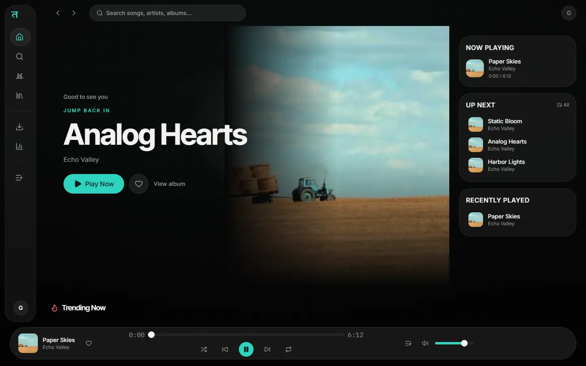
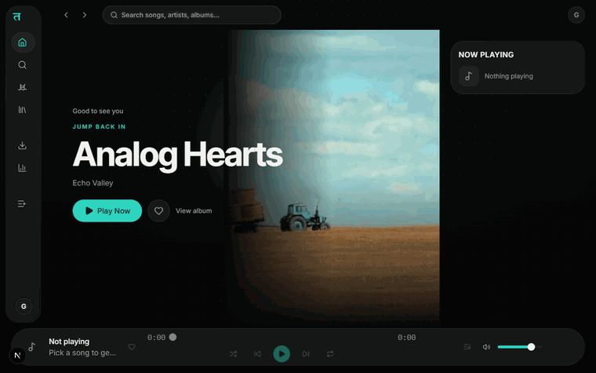
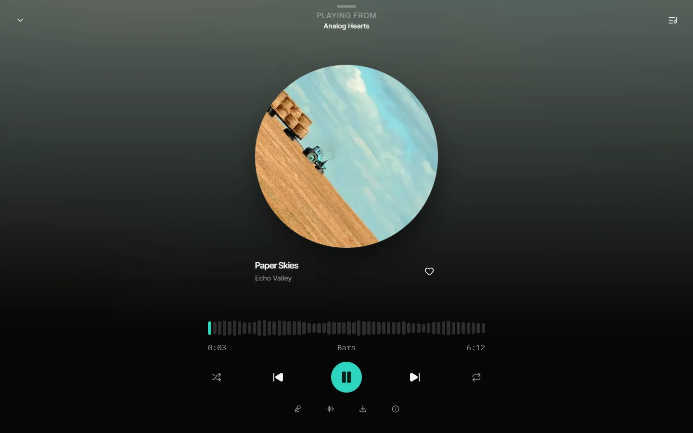
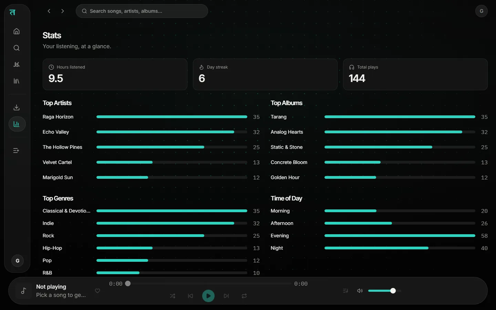
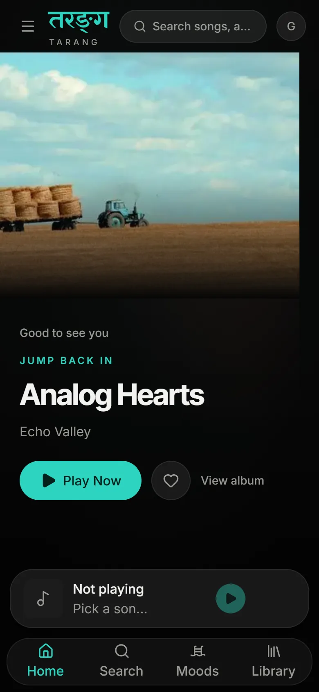
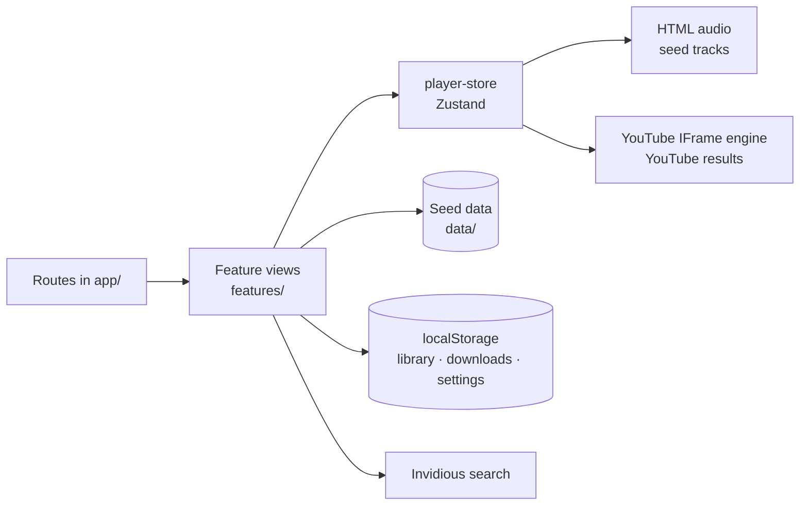

<div align="center">



<br />

     

<br />

**[Run it](#run-it)** &nbsp;·&nbsp; **[Features](#features)** &nbsp;·&nbsp; **[Architecture](#architecture)** &nbsp;·&nbsp; **[Installation](#installation)** &nbsp;·&nbsp; **[Reports](#reports)**

</div>

---

<p align="center">
  
</p>

Tarang (तरङ्ग, "wave") is a music-first streaming web app. It is not a Spotify clone: it is an exploration of what a player feels like when glass surfaces, one shared motion language and a documented design system are treated as product decisions.

It plays demo audio and YouTube search results through a persistent floating player, with a full now-playing view, a queue, time-synced lyrics with translations, playlists and folders, moods, listening stats and simulated offline downloads. There is no backend, account system or required environment variable. The catalog is seed data in `data/` and your state is kept in the browser.

## Run it

```bash
git clone https://github.com/Samudra-GITHub/Tarang.git
cd Tarang && npm install && npm run dev
```

Then open <http://localhost:3000>, press **Play Now**, and click the floating player to expand it.

## Features

<table>
  <tr>
    <td width="50%" valign="top">
      
      <h3>A player that persists</h3>
      <p>A floating mini player survives navigation and expands into a full now-playing view with a waveform progress bar, a queue drawer, lyrics, translations and a credits sheet.</p>
    </td>
    <td width="50%" valign="top">
      
      <h3>Stats and history</h3>
      <p>A listening journey with charts for top artists, albums, genres and time of day, plus pins and listening history.</p>
    </td>
  </tr>
  <tr>
    <td width="50%" valign="top">
      
      <h3>Responsive, with PWA basics</h3>
      <p>The layout adapts to phones with a mobile nav and sidebar sheet. A web manifest, generated icons, an Open Graph image, a sitemap and robots file are included.</p>
    </td>
    <td width="50%" valign="top">
      <h3>Search and discovery</h3>
      <p>Search across the catalog and YouTube (through public Invidious instances, with caching and fallback), a trending rail, moods with their own environments, and a library with playlists, folders and drag-and-drop cards.</p>
      <h3>Offline downloads (simulated)</h3>
      <p>Quality tiers, a storage estimate, smart downloads and an offline mode, backed by <code>localStorage</code>. There is no real offline storage.</p>
    </td>
  </tr>
</table>

**Also:** a living design-system reference at `/design-system`, an internal `/dev-tools` page, reduced-motion support, live-region announcements and global keyboard shortcuts.

## Tech stack

| Layer | Technology |
| :-- | :-- |
| Framework | Next.js 15 (App Router), React 19, TypeScript 5 |
| Styling | Tailwind CSS 4, design tokens in `styles/tokens.css`, shadcn/ui, Radix UI |
| Motion | Framer Motion with shared variants in `lib/motion.ts` and `lib/motion-variants.ts` |
| State | Zustand with `persist` |
| Playback and search | HTML audio, YouTube IFrame Player API, Invidious API |

## Architecture


```mermaid
flowchart LR
    UI[Routes in app/] --> V[Feature views<br/>features/]
    V --> P[player-store<br/>Zustand]
    P --> A[HTML audio<br/>seed tracks]
    P --> Y[YouTube IFrame engine<br/>YouTube results]
    V --> S[(Seed data<br/>data/)]
    V --> L[(localStorage<br/>library · downloads · settings)]
    V --> I[Invidious search]
```

- **The player store is the hub.** `lib/store/player-store.ts` owns playback state and bridges events from both the native audio element and the YouTube IFrame wrapper (`features/youtube/youtube-engine.ts`), so the UI does not care which engine is playing.
- **Thin routes, feature modules.** Files in `app/` stay small and render views from `features/`.
- **Design system first.** Tokens, typography, layout primitives and motion variants are shared by every route and documented in [docs/design-system.md](docs/design-system.md).

Known constraints: search relies on community-run Invidious instances that can go offline (the list is in `features/youtube/invidious-client.ts`), and artwork comes from `picsum.photos` with placeholder demo audio.

```text
Tarang/
├── app/            Routes: album, artist, playlist, library, search, moods,
│                   downloads, stats, settings, design-system, dev-tools
├── components/     cards, charts, collection, decorative, layout, tracks, ui
├── features/       home, player, library, search, moods, stats, downloads, settings, youtube
├── hooks/          reduced motion, shortcuts, online status, dominant colour, tilt
├── lib/            motion, glass tokens, formatting, search, stats, store/
├── data/           Seed songs, albums, artists, playlists, moods, lyrics
├── styles/         tokens.css
└── docs/           Design system, reports, screenshots
```

## Installation

Requires Node.js and npm.

```bash
npm install
```

| Command | What it does |
| :-- | :-- |
| `npm run dev` | Start the dev server on port 3000 |
| `npm run build` | Production build |
| `npm run start` | Serve the production build |
| `npm run lint` | Run ESLint |

### Environment

Nothing is required. Optionally set `NEXT_PUBLIC_SITE_URL` to the deployed origin so metadata, the sitemap and robots use the right URL (default `http://localhost:3000`).

### Deploy

No deployment configuration is included. It is a standard Next.js app (`npm run build`, then `npm run start`).

## Reports

The `docs/` folder holds the project's own write-ups: the [design system](docs/design-system.md), an [accessibility report](docs/accessibility-report.md), a [performance report](docs/performance-report.md), the [design-system migration status](docs/migration-status.md) and the [v3 release report](docs/v3-release-report.md).

## Limitations

- Downloads are simulated, and there is no catalog or playback backend.
- Demo artwork and audio are placeholder content.

## License

[MIT](LICENSE).
